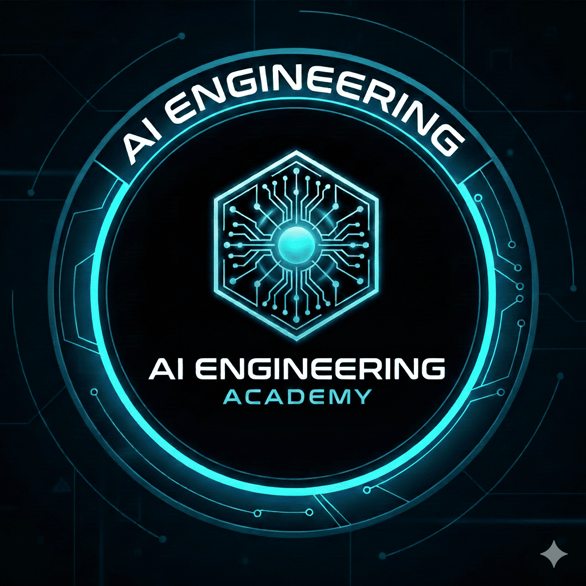

<p align="center">
  
</p>

<h1 align="center">Prompt Engineering</h1>

<p align="center">
  <strong>Demonstracoes Praticas | AI Engineering Academy</strong>
</p>

<p align="center">
  
  
  
</p>

---

## Sobre o Projeto

Este repositorio contem o material pratico da aula de **Prompt Engineering** da AI Engineering Academy. O objetivo e demonstrar que **prompt e especificacao** - estamos programando a comunicacao com LLMs.

> *"O que voces viram hoje nao foi magia. Foi engenharia de especificacao aplicada a linguagem. Prompt Engineering e programacao - so que em linguagem natural."*

---

## Objetivos Didaticos

| # | Objetivo |
|---|----------|
| 1 | Prompt e especificacao |
| 2 | Estrutura importa mais que eloquencia |
| 3 | Encadeamento (pipeline) melhora qualidade |
| 4 | Parametros e contexto alteram comportamento do modelo |

---

## Demonstracoes Disponiveis

### Modulo 1: Prompt Vago vs Estruturado
| Demo | Descricao | Conceito |
|------|-----------|----------|
| `demo_01` | Prompt Vago | Sem system prompt - modelo nao sabe qual papel assumir |
| `demo_02` | Prompt Estruturado | System + User prompt separados (best practice) |

### Modulo 2: Pipeline / Encadeamento
| Demo | Descricao | Conceito |
|------|-----------|----------|
| `demo_03` | Prompt Frankenstein | Anti-padrao: muitas tarefas juntas |
| `demo_04` | Pipeline Correto | Cada prompt faz uma coisa so - e faz bem |

### Modulo 3: Tecnicas Avancadas
| Demo | Descricao | Conceito |
|------|-----------|----------|
| `demo_05` | Few-Shot Learning | Aprendizado por exemplos |
| `demo_06` | Sem Chain-of-Thought | Resposta direta (problematico) |
| `demo_07` | Com Chain-of-Thought | Raciocinio passo a passo |

### Modulo 4: Multi-Agentes
| Demo | Descricao | Conceito |
|------|-----------|----------|
| `demo_08` | Multi-Agentes | LLM auditando LLM |

### Modulo 5: Temperature
| Demo | Descricao | Conceito |
|------|-----------|----------|
| `demo_09` | Temperature Baixa (0) | Precisao e determinismo |
| `demo_10` | Temperature Alta (0.9) | Criatividade e variacao |

### Bonus
| Demo | Descricao | Conceito |
|------|-----------|----------|
| `bonus` | Comparacao System Prompts | Mesmo prompt, comportamentos diferentes |

---

## Instalacao

```bash
# Clone o repositorio
git clone <repo-url>
cd prompt-engineering

# Crie e ative o ambiente virtual
python -m venv venv
source venv/bin/activate  # Linux/Mac
# ou
venv\Scripts\activate     # Windows

# Instale as dependencias
pip install -r requirements.txt
```

---

## Configuracao

Crie um arquivo `.env` na raiz do projeto:

```env
OPENAI_API_KEY=sua-chave-aqui
```

---

## Como Usar

### Menu Interativo (Recomendado)

```python
# Descomente no main.py:
menu_principal()
```

```bash
python main.py
```

### Executar Demos Individuais

```python
# No main.py, descomente a demo desejada:
demo_01_prompt_vago()
demo_02_prompt_estruturado()
demo_03_prompt_frankenstein()
# ...
```

---

## Estrutura do Projeto

```
prompt-engineering/
├── assets/
│   └── banner.png          # Logo do curso
├── docs/
│   └── *.pdf               # Material teorico
├── main.py                 # Codigo das demonstracoes
├── requirements.txt        # Dependencias
├── .env                    # Variaveis de ambiente (nao commitado)
└── README.md
```

---

## Best Practices Abordadas

```
┌─────────────────────────────────────────────────────────────┐
│  "System prompt define QUEM. User prompt define O QUE."     │
└─────────────────────────────────────────────────────────────┘
```

- **Sempre use System Prompt** para definir comportamento persistente
- **Separe tarefas complexas** em pipelines de prompts especializados
- **Use Few-Shot** quando precisar de consistencia na saida
- **Chain-of-Thought** para problemas que requerem raciocinio
- **Ajuste Temperature** conforme a tarefa (0 = precisao, 0.9 = criatividade)
- **Multi-Agentes** para validacao e controle de qualidade

---

## Tecnologias

<p>
  
  
</p>

---

## Licenca

Este projeto faz parte do curriculo da **AI Engineering Academy**.

---

<p align="center">
  <strong>AI Engineering Academy</strong><br/>
  <em>Formando engenheiros de IA do futuro</em>
</p>
